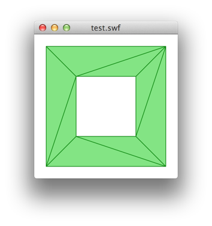

# as3libtess2

This is the tesselation library [libtess2](https://github.com/memononen/libtess2), compiled to ActionScript 3 via Adobe CrossBridge.

Quoting the original README:

> This is refactored version of the original libtess which comes with the GLU reference implementation. The code is good quality polygon tesselator and triangulator. The original code comes with rather horrible interface and its performance suffers from lots of small memory allocations. The main point of the refactoring has been the interface and memory allocation scheme.

> A lot of the GLU tesselator documentation applies to Libtess2 too (apart from the API), check out http://www.glprogramming.com/red/chapter11.html

> Simple bucketed memory allocator (see Graphics Gems III for reference) was added which speeds up the code by order of magnitude (tests showed 15 to 50 times improvement depending on data). The API allows the user to pass his own allocator to the library. It is possible to configure the library so that the library runs on predefined chunk of memory.

> The API was changed to loosely resemble the OpenGL vertex array API. The processed data can be accessed via getter functions. The code is able to output contours, polygons and connected polygons. The output of the tesselator can be also used as input for new run. I.e. the user may first want to calculate an union all the input contours and the triangulate them.

The code is released under [SGI FREE SOFTWARE LICENSE B Version 2.0](http://oss.sgi.com/projects/FreeB/).

The original author is [Mikko Mononen](mailto:memon@inside.org).

## Getting started

A simple example:

```as3
import com.codeazur.libtess2.Tesselator;

var pathOuter:Vector.<Number> = Vector.<Number>([0, 0,   200, 0,  200, 200, 0, 200]);
var pathInner:Vector.<Number> = Vector.<Number>([50, 50, 150, 50, 150, 150, 50, 150]);

var t:Tesselator = new Tesselator();
t.newTess(1024 * 1024);
t.addContour(pathOuter, pathOuter.length / 2, 2);
t.addContour(pathInner, pathInner.length / 2, 2);
t.tesselate(Tesselator.WINDING_ODD, Tesselator.ELEMENT_TYPE_POLYGONS, 3, 2);
var vertices:Vector.<Number> = t.getVertices();
var vertexCount:int = t.getVertexCount();
var elements:Vector.<int> = t.getElements();
var elementCount:int = t.getElementCount();
t.deleteTess();
```



## API

The ActionScript API is kept close to the original C API.

```as3
newTess(size)
```
Creates a new tesselator.
* size - The memory, in bytes, to allocate.

```as3
deleteTess()
```
Deletes a tesselator.

```as3
addContour(vertices, count, size)
```
Adds a contour (a closed subpath of the shape) to be tesselated.
* vertices - A ```Vector.<Number>``` containing the vertices of the contour to add.
* count - The number of vertices in the contour.
* size - The number of coordinates per vertex. Must be 2 or 3.

```as3
tesselate(windingRule, elementType, polySize, vertexSize)
```
Tesselates the contours.
* windingRule - The winding rule used for tesselation.
  * ```Tesselator.WINDING_ODD```
  * ```Tesselator.WINDING_NONZERO```
  * ```Tesselator.WINDING_POSITIVE```
  * ```Tesselator.WINDING_NEGATIVE```
  * ```Tesselator.WINDING_ABS_GEQ_TWO```
* elementType - The tesselation result element type.
  * ```Tesselator.ELEMENT_TYPE_POLYGONS```
  * ```Tesselator.ELEMENT_TYPE_CONNECTED_POLYGONS```
  * ```Tesselator.ELEMENT_TYPE_BOUNDARY_CONTOURS```
* polySize - The maximum number of vertices per polygons if the output is polygons.
* vertexSize - The number of coordinates in tesselation result vertex, must be 2 or 3.

Returns 1 (success) or 0 (error)

```as3
getVertexCount()
```
Returns the number of vertices in the tesselated output.

```as3
getVertices()
```
Returns a ```Vector.<Number>``` containig the vertices.

```as3
getVertexIndices()
```
Returns a ```Vector.<int>``` containig the vertex indices.

Vertex indices can be used to map the generated vertices to the original vertices.
Every point added using ```addContour()``` will get a new index starting at 0.
New vertices generated at the intersections of segments are assigned value 0.

```as3
getElementCount()
```
Returns the number of elements in the tesselated output.

```as3
getElements()
```
Returns a ```Vector.<int>``` containig the element indices.

## Build

In order to build as3libtess2 from source, you need to have [Adobe CrossBridge](http://adobe-flash.github.io/crossbridge/) installed.

Then call ```make CB_SDK=/path/to/crossbridge/sdk```.
